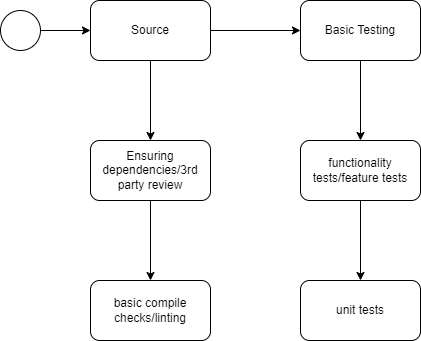
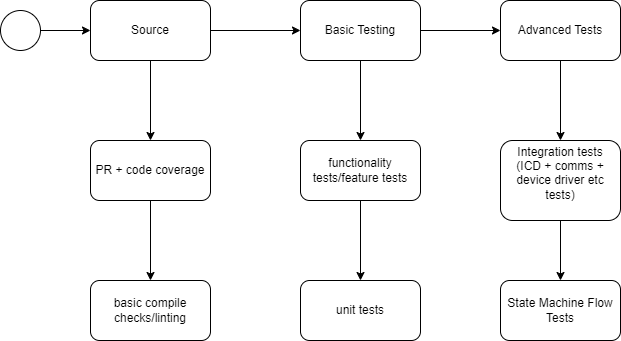
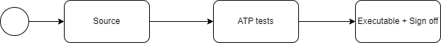

## CI/CD pipeline

The following pipelines need to be implemented

1. A pipeline which runs the automated tests every time there is a push on a branch which is not the master

2. A pipeline which run and builds the repository as a whole only on the master when there is a push on the master branch. The executable which can be deployed is only developed on the master branch

3. A pipeline which runs a set of ATPs when creating a release load

