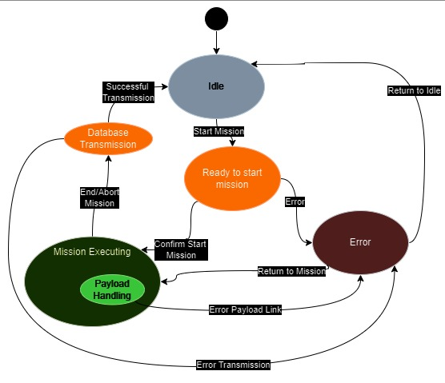

# GCS Description

## Assumptions
1. *The drone architecture is not frozen and can be adjusted according to the GCS(for the purposes of this project, even though it is the other way around)*
2. *There is a dedicated C2Link between the drone and GCS, separate from the payload data link*
3. *The database will be operating on a separate machine which needs to be interfaced with remotely*
4. *As there is no physical link to the drone and no discernible way to determine if the mission is ended for this project we assume that a started mission is only completed when the end mission button is pressed*

## Components
1. `User`
2. `Drone`
3. `C2 Link`
4. `GCS - Backend Link`
5. `GCS`

## Requirements
1. *`Interact between GCS and UAV via communication link`*
    - Ensure Uplink connection from GCS to drone
    - Ensure Downlink connection from drone to GCS
    - Stable connection throughout mission profile
        -  Stable connection is defined as a minimum upload and download rate to be determined later on depending on payload requirements
    - Downlink connection should have higher bandwidth than uplink
    - Communication module on GCS should have omnidirectional antenna
    - Communication module on Drone should have omnidirectional redundant antenna
    - Regular heartbeat messages from drone to GCS to ensure signal strength at an interval to be defined later
    - Regular health status messages from drone to GCS(critical for user to determine if mission should be aborted)
    - receive payload data from drone on GCS via dedicated payload data link
    - send user commands from GCS to drone over uplink connection
2. *`Interact between GCS and backend database`*
    - Ensure Uplink connection from GCS to database
    - Ensure Downlink connection from database to GCS
    - Uplink should have higher bandwidth than Downlink
    - Send mission id from GCS to database
    - Receive mission details from database
    - Transfer payload data to database
3. *`Setup GCS interactions between HW and SW`*
    - Setup GUI for user interaction
    - Interface GUI with HW C2link box for C2Link communication
    - Interface GUI with Wifi/Wired connection for TCP communication to database
    - ICD between GCS and drone to account for different message types
    - ICD between GCS and database
    - Devlop device driver to interact between GCS and c2Link hardware
        - Determine driver details
        - Develop driver which can be accessed from multiple threads
    - Develop device driver to interact between GCS and database connection hardware unite
        - Determine driver details
        - Develop driver which can be accessed from multiple threads

    

    - Implement a multiple thread SW setup with following threads
        - Drive the UI and interact with database
        - Receive C2Link Downlink messages
        - Receive Payload Link Downlink messages
        - communicate uplink messages to Drone over C2Link

        

4. *`Provide GUI for user interaction`*
    - Functionality to start mission
        - Prompt the user for double confirmation for start of mission
        - allow user to abort start of mission in double confirmation
        - Only start mission if mission is selected
        - Allow User to select drone from multiple drone operations
    - Functionality to select mission
    - Functionality to end mission
        - only allow user to end mission if one was started
    - Functionality to select how to end mission
        - Hover in place
        - Return to home
        - Altitude Hold
    - Functionality to abort mission
        - Aborting only allows to hover in place
    - Functionality to control Payload
        - preview camera
        - save image on screen(limited to save present image only)
        - send image to database with mission details
    - Give appropriate feedback to User
        - which mission id was transmitted to the drone
        - which mode the mission was cancelled in
        - if data was succesfully saved to database
        - provide timestamp for all the feedback to help operator perception
        - provide feedback messages about errors/logs/paylaod interaction to the user
        - color code the messages for ease of importance detection for the user
    - Handle errors from payload
        - Indicate to user if the payload interface to drone has failed
        - corrupted image file should be indicated as such

    

5. Keep track of revision history of the GCS for posterity

*P.S.: the requirements for the drone, user and database are outside the scope of this assignment*

After Cumulation of all requirements a state diagram was determined as shown in the image below. It is to be used a reference for the GCS

