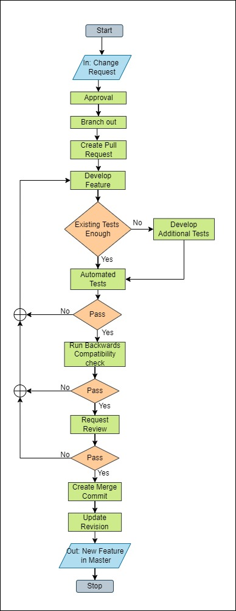
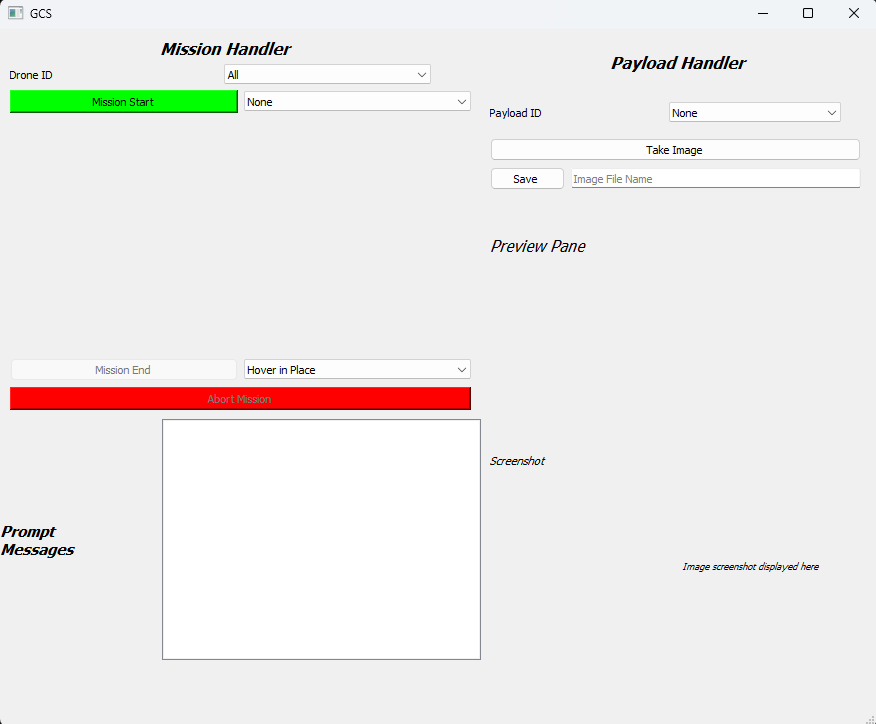
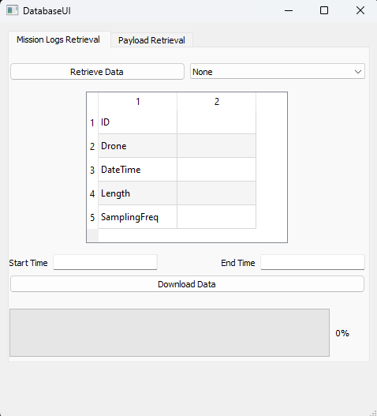
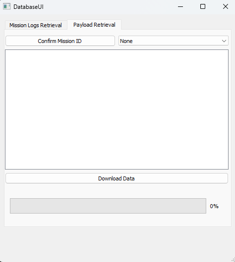

# GalaxEyeSystemArchitect

## Architecture
The problem as defined is first broken down into its requirements.
This along with the assumptions made are defined in [Requirements.md](Docs/Requirements.md)

## Implementation

After defining the architecture we need to define the process workflow and how exactly the design engineers should go about the development process

## Code Description

The code has been developed to be as parameterized and as abstract as possible. Additionally the comments were added in a way which can be incorporated into a doxygen environment for quick code report generation.

The Solution presented includes a UI for the GCS

and a UI for the database interaction with 2 individual section:

1. For downloading the mission logs

    

2. For downloading the payload data saved
    
    

## Testing

The requirements for testing are elaborated in [Testing.md](Docs/Testing.md)

## Deployment

As the process workflow describes the project has some pipelines which need to be deployed. They are described in detail in [CI_CD.md](Docs/CI_CD.md)

However, such a pipeline could not be tested thoroughly and therefore has not been presented. Instead in order to deploy follow the instructions as follows:

Deploying GCS API:
1. change working directory to src/GCS_app
2. run the main_api.py file

Deploying the database interface/app
1. change working directory to src/database_UI
2. run the main_database.py file

### Code Dependencies

The code needs python 3 installed. It was developed using v3.11.3
The following libraries are needed:

1. PyQt5 
2. datetime
3. sys
4. csv
5. pandas
6. time

Any other libraries were custom developed for this project

*Note: While most all these libraries are available if other libraries were to be used for commercial operations, their licensing issues would need to be verified first*

## Scalability

The scalability for the system can be accounted to include for:
1. Additional Drones
2. Additional Payloads
3. Multiple simulataneous missions
4. Mutliple simultaneous paylaods
5. New Drone variants

Measure to be taken during dev for this:

1. Making tabs on the GCS for dedicated mission and dedicated payload sections
2. Use a stable commercial protocol like MAVLINK for c2link
3. Use a very basic not overly specific initial structure which allows freedom of changing functionality
4. Use coding practices which allow for easy addition of new functions

## Limitations

The solution presented has a few limitations:

1. Even though it was considered an ICD was not able to be developed for any of the connections described in ~[Requirements.md](Docs/Requirements.md)
2. It was considered to setup as a demonstrator a communication link between the GCS and the database through a network interface hosted on the local machine, however it was unable to be developed in time
3. While a requirement of the assignment was to ensure that the solution could be deployed on a linux machine, it could not be verified as no linux machine could be arranged in time. However with the appropriate pipeline setup as in section Deployment, such manual checks will not be necessary